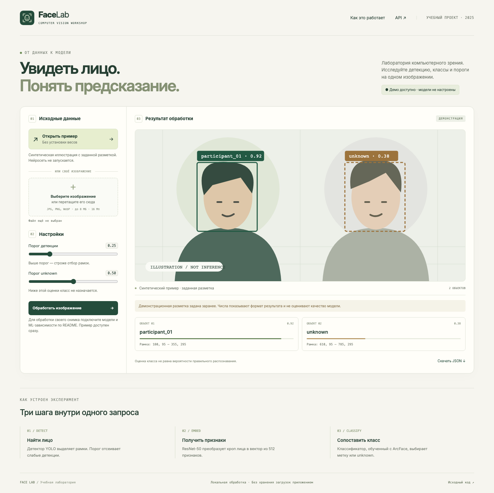
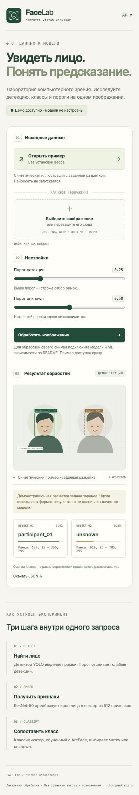

<div align="center">
  
  <h1>Face Lab</h1>
  <p><strong>Увидеть лицо. Понять предсказание.</strong></p>
  <p>Учебная лаборатория компьютерного зрения: от подготовки данных<br>и обучения ArcFace до локального API и наглядного результата.</p>
  <p>
    <a href="https://github.com/nickihysterics/Face-Lab/actions/workflows/ci.yml"></a>
    <a href="https://github.com/nickihysterics/Face-Lab/releases/latest"></a>
    
    
    
  </p>
  <p><a href="#быстрый-старт">Запуск</a> · <a href="docs/demo.md">Сценарий демонстрации</a> · <a href="docs/training.md">Обучение</a> · <a href="docs/architecture.md">Архитектура и API</a> · <a href="https://github.com/nickihysterics/Face-Lab/releases">Релизы</a></p>
</div>



## О проекте

Face Lab — учебно-демонстрационный проект, выросший из работы для «Профессионалов — 2025». Он показывает полный путь небольшого CV-эксперимента: подготовку размеченных изображений, разделение выборки, обучение классификатора с ArcFace, оценку и обработку одного изображения через веб-интерфейс или CLI.

Демонстрация запускается сразу, без PyTorch, GPU и весов. Для настоящего инференса нужны отдельно установленные ML-зависимости, детектор лиц и собственный обученный классификатор. Предобученные веса и фотографии людей в публикацию не входят.

| Режим | Что происходит | Что требуется |
| --- | --- | --- |
| Пример в интерфейсе | Показывается синтетическая иллюстрация с заданными рамками и оценками | Базовые зависимости |
| Проверка ML-пайплайна | ResNet-50 действительно обучается одну эпоху на геометрических фигурах | ML-зависимости, CPU |
| Инференс своего изображения | YOLO находит лица; ResNet-50 и обученная голова назначают класс | Три файла в `models/` |

**Числа в демонстрации заданы заранее.** Обучение на фигурах проверяет связность кода; оно не измеряет качество распознавания лиц. `unknown` — пороговая эвристика, а не подтверждённое распознавание неизвестного человека.

## Возможности

- Лёгкий локальный сервер и адаптивный интерфейс с загрузкой файла, порогами, рамками, карточками и экспортом JSON.
- Подготовка одного явно выбранного датасета: проверка файлов, удаление точных дубликатов по пикселям, воспроизводимое разбиение внутри классов.
- ResNet-50, эмбеддинг из 512 признаков и ArcFace при обучении; валидация и тест без передачи целевой метки предиктору.
- Сохранение лучшей модели по validation accuracy; отдельная оценка на test; JSON-отчёты и журналы.
- Ограничение загрузки и размеров изображения, коррекция EXIF, проверка порогов, понятные ошибки API.
- Автоматические проверки API, ML, браузера и Docker; исходный архив релиза с SHA-256.

<details>
<summary>Мобильный интерфейс</summary>
<br>

</details>

## Быстрый старт

Требуется **Python 3.12**. Команды выполняются из корня проекта.

```bash
git clone https://github.com/nickihysterics/Face-Lab.git
cd Face-Lab
python -m venv .venv
```

Активация окружения:

```bash
# macOS / Linux
source .venv/bin/activate
```

```powershell
# Windows PowerShell
.venv\Scripts\Activate.ps1
```

```bash
python -m pip install -r requirements.txt
python -m uvicorn app.api:app --host 127.0.0.1 --port 8000
```

Откройте [localhost:8000](http://127.0.0.1:8000) и нажмите **«Открыть пример»**. Интерфейс покажет заданную разметку, две карточки и кнопку скачивания JSON. [Swagger UI](http://127.0.0.1:8000/docs) доступен на том же сервере. Остановка — `Ctrl+C`.

Если активация окружения запрещена политикой PowerShell, используйте `.venv\Scripts\python.exe` вместо `python` без изменения системной политики.

### Docker

```bash
docker compose up --build web
```

Это лёгкий образ без ML-библиотек. Он запускается от непривилегированного пользователя и публикует порт только на `127.0.0.1`. Остановка и удаление контейнеров проекта: `docker compose down`.

Для CPU-инференса после подготовки весов задайте `FACE_LAB_TARGET=ml` в окружении и пересоберите `web`. Linux-образ ML устанавливает CPU-версии PyTorch; CUDA в Docker здесь не настроена. Подробности — [обучение и Docker](docs/training.md#docker).

## Обучение и подключение моделей

Установите дополнительный набор зависимостей:

```bash
python -m pip install -r requirements-ml.txt
```

Проверьте весь цикл без внешних данных и скачивания предобученных весов:

```bash
python scripts/smoke_pipeline.py
```

Для своего эксперимента расположите подготовленные **кропы лиц** по классам:

```text
datasets/faces/
├── participant_01/
│   ├── 001.jpg
│   ├── 002.jpg
│   └── 003.jpg
└── participant_02/
    ├── 001.jpg
    ├── 002.jpg
    └── 003.jpg
```

Две категории и три разных изображения на категорию — технический минимум, достаточность данных для качественной модели этим не определяется.

```bash
python scripts/prepare_dataset.py --base datasets/faces --out reports/dataset
python scripts/train_model.py --base datasets/faces --splits reports/dataset/splits.csv --epochs 5 --batch-size 16 --export-dir models
```

Классификатор по умолчанию обучается с нуля. Флаг `--pretrained` отдельно разрешает загрузку весов ResNet-50 из torchvision. Подготовьте детектор лиц из доверенного источника и получите итоговую структуру:

```text
models/
├── yolov8n-face.pt     # YOLO-детектор именно лиц, добавляется отдельно
├── arcface_model.pth  # state_dict, экспортируется обучением
└── classes.json       # соответствие индексов меткам из того же запуска
```

Перезапустите сервер после установки пакетов и замены моделей. Теперь можно загрузить своё изображение. [Полное руководство](docs/training.md) объясняет формат CSV, отчёты, получение детектора, ограничения разбиения и проверку результата.

## API

| Метод | Путь | Назначение |
| --- | --- | --- |
| GET | `/health` | Жив ли веб-сервер; это не проверка весов |
| GET | `/api/status/` | Наличие пакетов и файлов моделей |
| GET | `/api/demo/` | Фиксированная демонстрация с `mode: demo` |
| POST | `/api/predict/` | Детекции, метки и JPEG в Base64 |
| POST | `/api/predict_json/` | Те же детекции без изображения |

```bash
curl -X POST http://127.0.0.1:8000/api/predict_json/ \
  -F "file=@example.jpg" -F "conf=0.25" -F "unknown_threshold=0.5"
```

Форматы: JPEG, PNG, WebP; файл до 8 МиБ и 16 мегапикселей. Пороги — конечные числа от 0 до 1. Если модели отсутствуют, настоящий инференс возвращает `503`, демонстрация остаётся доступной. [Поля ответа и коды ошибок](docs/architecture.md#контракт-api).

## Структура

```text
app/                    FastAPI, конфигурация, проверка изображений и демо
ml/                     подготовка данных, ResNet/ArcFace, обучение и инференс
scripts/                CLI, синтетические данные, проверки пайплайна и браузера
web/                    HTML, CSS, JavaScript и векторный знак
examples/               синтетическая иллюстрация и заданный JSON
models/, datasets/      локальные артефакты; в Git входят только инструкции
reports/                локальные отчёты экспериментов
tests/                  регрессионные тесты API, данных, моделей и загрузчика
docs/                   руководства, ограничения и снимки интерфейса
pipeline_notebook.ipynb  пошаговый учебный эксперимент
.github/workflows/      CI и публикация исходного релиза
```

## Проверки

```bash
python -m pip install -r requirements-dev.txt
python -m pytest -q
python -m ruff check app ml scripts tests
python -m ruff format --check app ml scripts tests
```

Без ML-зависимостей соответствующий модуль тестов пропускается. После установки `requirements-ml.txt` выполните тесты ещё раз и запустите `scripts/smoke_pipeline.py`. Браузерные проверки и состав CI описаны в [docs/testing.md](docs/testing.md).

## Учебные границы

Проект реализует классификацию по известным при обучении классам. Он не содержит выравнивания лица по ключевым точкам, отдельного алгоритма поиска по галерее, оценки FAR/FRR, калибровки уверенности или защиты от предъявления фотографии. Изменение числа классов влияет на softmax и порог `unknown`.

Сервис рассчитан на локальную демонстрацию с одним процессом. Приложение не сохраняет HTTP-загрузки в постоянное хранилище; CLI намеренно пишет результат и журнал в `reports/`. Для экспериментов используйте данные, на обработку которых у вас есть разрешение. [Подробнее об ограничениях](docs/limitations.md).

## Материалы и условия использования

- [ArcFace: Additive Angular Margin Loss for Deep Face Recognition](https://arxiv.org/abs/1801.07698) — исходная работа о функции потерь.
- [PyTorch: Save and Load the Model](https://docs.pytorch.org/tutorials/beginner/basics/saveloadrun_tutorial.html) — загрузка `state_dict` и режим оценки.
- [Сторонние компоненты и веса](THIRD_PARTY_NOTICES.md) — источники и отдельные условия использования.

В исходном репозитории не было файла лицензии. Эта публикация не добавляет от имени автора новую лицензию на весь проект; публичная доступность исходников не заменяет разрешения на их дальнейшее использование. Данные и веса имеют собственные условия и в релиз не включены.
